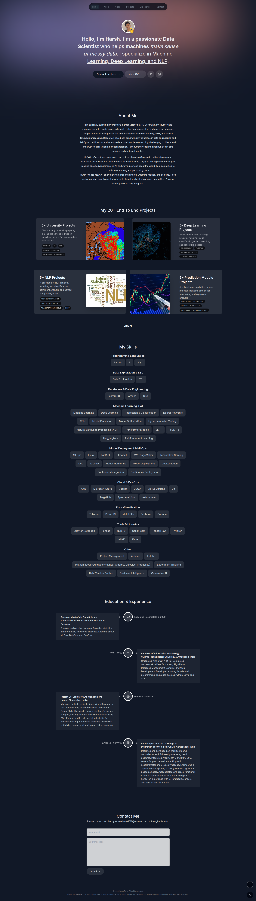

# Harsh's Portfolio Website

[🌐 **Live Website**](https://harsh-rana-mu.vercel.app/)

Welcome to my personal portfolio website, built with Next.js 13, TypeScript, and Tailwind CSS.

## ✨ Overview

This site showcases my skills, projects, and professional experience in data science, machine learning, and software engineering. It features a modern, responsive design with light/dark mode, smooth animations, and a contact form for easy communication.

## 🛠️ Tech Stack

- **Next.js 13** (App Router)
- **TypeScript**
- **Tailwind CSS**
- **Framer Motion** (animations)
- **Context API** (state management)
- **React Email & Resend** (contact form)
- **Custom React Hooks**

## 🌟 Features

- Project highlights and detailed project pages
- Categorical skills section
- Experience timeline
- Responsive design with light/dark mode
- Animated transitions and interactions
- Contact form with email integration

## 📫 Contact

Feel free to reach out via the contact form on the website or connect with me on [LinkedIn](https://www.linkedin.com/in/harshweb98/).

---

> Thank you for visiting my portfolio!

